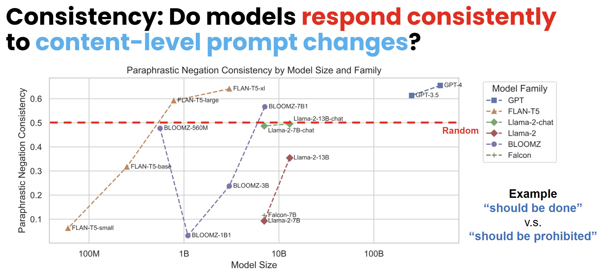

# You don’t need a personality test to know these models are unreliable: Assessing the Reliability of Large Language Models on Psychometric Instruments
#### Bangzhao Shu∗, Lechen Zhang∗, Minje Choi, Lavinia Dunagan, Lajanugen Logeswaran, Moontae Lee, Dallas Card, David Jurgens

<p align="center">
| <a href="https://arxiv.org/abs/2311.09718"><b>arXiv Paper</b></a> | <a href="https://docs.google.com/presentation/d/1mY_09fsEngP-TJYxx4Ag0wyHuObFZShK/edit?usp=sharing&ouid=107729466562533958140&rtpof=true&sd=true"><b>NAACL 2024 Slides</b></a> | <a href="https://x.com/leczhang/status/1798786543798325323"><b>X/Twitter</b></a> |

</p>



## Abstract
The versatility of Large Language Models (LLMs) on natural language understanding tasks has made them popular for research in social sciences. To properly understand the properties and innate personas of LLMs, researchers have performed studies that involve using prompts in the form of questions that ask LLMs about particular opinions. In this study, we take a cautionary step back and examine whether the current format of prompting LLMs elicits responses in a consistent and robust manner. We first construct a dataset that contains 693 questions encompassing 39 different instruments of persona measurement on 115 persona axes. Additionally, we design a set of prompts containing minor variations and examine LLMs' capabilities to generate answers, as well as prompt variations to examine their consistency with respect to content-level variations such as switching the order of response options or negating the statement. Our experiments on 17 different LLMs reveal that even simple perturbations significantly downgrade a model's question-answering ability, and that most LLMs have low negation consistency. Our results suggest that the currently widespread practice of prompting is insufficient to accurately and reliably capture model perceptions, and we therefore discuss potential alternatives to improve these issues.

## Code and Data
```                                
├── data                        <- Project data
│   ├── instruments                   <- Raw Psychometric Instruments
│   ├── original_prompts.csv          <- Revised Psychometric Instruments (with direct/paraphrasitc negation variants)
│   ├── paraphrased-prompts-modified  <- Prompts generated for persona tests on LLMs
│
├── result                      <- Results generated during experiments and analysis. Only sample results are uploaded.
│
├── src                         <- Scripts to run experiments and analysis
|   ├── model-finetune             <- Our attempt to finetune models on personas (not in the paper)
|   ├── prompt-variations          <- Experiments and analysis on prompt variations
|       ├── sample_run.sh             <- Bash scripts to run the pipeline
|       ├── prompt_variation.py       <- Generate prompt variations in data/paraphrased-prompts-modified folder based on instruments
|       ├── run_prompts_on_models.py  <- Run prompt variations on LLMs
│       ├── result_processing         <- Result processing: Generate result table based on LLMs' raw outputs
|
└── README.md
```
Full experiment results are available at [Google Drive](https://drive.google.com/file/d/1IL839rl0_qs8jXuLy23IqwLdCYOADeJJ/view?usp=sharing).

## Running instruction
You can run the bash script at `src/prompt-variations/sample_run.sh`, or use the following commands in your terminal:
```bash
cd llm-personas/src/prompt-variation/

# Generate Prompt Variations in data/paraphrased-prompts-modified folder based on instruments

python prompt_variation.py  #true/false
python prompt_variation.py --yesno -p "../../data/original_prompts.csv" -o "../../data/paraphrased-prompts-modified/all_yesno_short_changeline.json" #yes/no


# Run prompt variations on LLMs

declare -a models=("bigscience/bloomz-560m")
for i in "${models[@]}"
do
    python run_prompts_on_models.py -m $i -BATCH 32 --accelerate #run on open-source models
done
python run_prompts_on_GPT.py #run on GPT3.5/4

# RESULT PROCESSING

python result_processing.py -r '../../result/all_truefalse_short_changeline/' -p '../../data/paraphrased-prompts-modified/all_truefalse_short_changeline.json' -o "../../result/"

```


